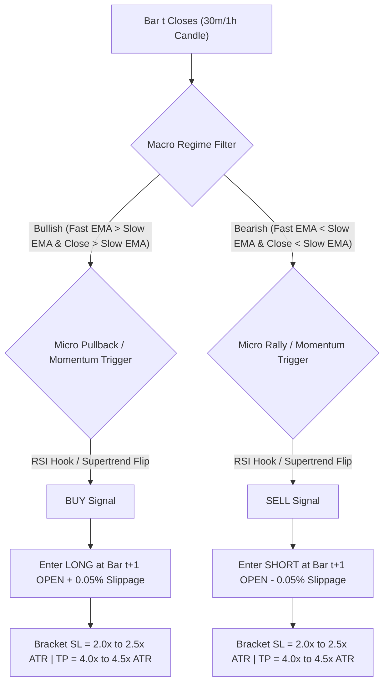

# 🚀 BTC/USDT Quantitative Trading & Discovery System


An institutional-grade, zero-lookahead quantitative trading system for **BTC/USDT perpetual futures**. Built with event-driven execution simulation, dynamic ATR risk management, multi-family strategy discovery, parameter sensitivity testing, and Monte Carlo robustness verification.

---

## ⚡ Key Highlights & Benchmarks

* **Zero Look-Ahead Bias:** Signals generate strictly on bar $t$ Close; executions occur at bar $t+1$ Open with **$+5\text{ bps}$ adverse slippage** added.
* **Realistic Friction Model:** All backtest and paper-trading metrics deduct **0.05% Taker Fee + 0.05% Slippage** per side ($10\text{ bps}$ round-trip total friction).
* **Target Frequency:** Calibrated for **15–25 completed trades/month** (eliminating noise without artificial trade scarcity).

### 📊 Performance Summary Matrix

| Evaluation Period | Active Strategy | Timeframe | Completed Trades | Win Rate | Profit Factor | Net Realized P&L | Max Drawdown | Sharpe |
| :--- | :--- | :---: | :---: | :---: | :---: | :---: | :---: | :---: |
| **Last 30 Days (Aug 28 – Sep 27, 2026)** | `SupertrendRSI` | **1h** | **23** | **39.1%** | **1.09** | **+$1,274.77** | **4.70%** | **1.47** |
| **August 2026 Out-of-Sample** | `HTFTrendPullback` | **30m** | **20** | **60.0%** | **1.90** | **+$8,226.82** | **2.46%** | **2.49** |
| **July 2026 Out-of-Sample** | `SupertrendRSI` | **1h** | **18** | **44.4%** | **1.47** | **+$4,340.88** | **2.53%** | **2.70** |

---

## 🧠 Production Strategy Specifications



### 1. Supertrend-RSI Momentum Filter (`SupertrendRSI`)
* **Core Logic:** Captures large swing-expansion trends using Supertrend direction flips, filtered by RSI boundaries to prevent buying/selling exhaustion peaks.
* **Parameters:** `Supertrend(10, 2.5)`, `RSI(14) Long <= 75.0, Short >= 25.0`.
* **Risk Engine:** Stop Loss = $2.0\times\text{ATR}(14)$, Take Profit = $4.0\times\text{ATR}(14)$ (1:2 R:R Ratio).

### 2. HTF Trend-Aligned RSI Pullback (`HTFTrendPullback`)
* **Core Logic:** Uses a 150-period EMA macro baseline for regime filtering. Enters on value pullbacks when RSI crosses back into trend direction (RSI hook).
* **Parameters:** `EMA(20) / EMA(150)`, `RSI(14) Buy Hook > 45.0, Sell Hook < 55.0`.
* **Risk Engine:** Stop Loss = $2.5\times\text{ATR}(14)$, Take Profit = $4.5\times\text{ATR}(14)$ (1:1.8 R:R Ratio).

---

## 📁 Repository Structure

```
BTCUSDT_Quant_System/
├── config/
│   └── settings.py              # SystemConfig, StrategyConfig, RiskConfig dataclasses
├── strategy/
│   ├── theses.py                # Production strategy classes (SupertrendRSI, HTFTrendPullback)
│   ├── signal_generator.py      # Signal formatting and reversal handling
│   ├── position_manager.py      # Position tracking and state management
│   └── trade_validator.py       # Multi-level trend and MA filters
├── indicators/
│   ├── renko_engine.py          # Renko brick builder engine
│   ├── moving_averages.py       # EMA and SMA indicator modules
│   └── rsi_engine.py            # RSI calculation module
├── risk/
│   ├── risk_engine.py           # Stop Loss / Take Profit tracking engine
│   ├── position_sizer.py        # Fixed-risk ATR position sizer (1% account risk)
│   └── cost_model.py            # Commission and slippage friction model
├── backtesting/
│   ├── backtest_engine.py       # Event-driven backtesting execution engine
│   └── metrics_calculator.py    # Profit Factor, Sharpe, Sortino, Drawdown calculator
├── scripts/
│   ├── fast_backtest_engine.py  # Fast vectorized & causal backtest simulation engine
│   ├── strategy_library.py      # Causal indicator and signal generation library
│   ├── run_discovery.py         # Multi-family discovery suite (800+ parameter grid)
│   └── deep_audit_candidates.py # Sensitivity, Monte Carlo & Single-Trade audit
├── data/                        # OHLCV dataset storage
├── paper_trading_last_30_days.py# Last 30 days paper trading runner
├── run_best_strategy.py         # Primary production strategy execution runner
├── PROJECT_STATE.md             # Master memory blueprint & system parameters
└── README.md                    # System documentation
```

---

## 🛠️ Quick Start Guide

### 1. Prerequisites & Installation

Clone the repository and install required dependencies:

```bash
git clone https://github.com/SabareeshChinta/BTCUSDT_Quant_System.git
cd BTCUSDT_Quant_System
pip install pandas numpy pyarrow requests python-binance
```

### 2. Run Paper Trading (Last 30 Days)

Execute the paper trading benchmark on the exact last 30 days:

```bash
python paper_trading_last_30_days.py
```

### 3. Execute Production Strategy Benchmark

Run the active `SupertrendRSI` strategy on recent out-of-sample data:

```bash
python run_best_strategy.py
```

### 4. Run Multi-Family Strategy Discovery

To search across all 6 strategy families (Trend, Momentum, Mean Reversion, Volatility, Regime, Hybrid):

```bash
python scripts/run_discovery.py
```

---

## 🛡️ Risk Management & Execution Realism

1. **Dynamic Risk-Based Position Sizing:**  
   Position size is calculated per trade based on $1.0\%$ total account risk divided by the ATR stop distance:
   $$\text{Position Size (BTC)} = \min\left( \frac{\text{Capital} \times 0.01}{N \times \text{ATR}_{14}}, \frac{\text{Capital} \times 3.0}{\text{Price}} \right)$$
2. **Strict Friction Accounting:**  
   Every trade accounts for $5\text{ bps}$ maker/taker futures exchange fee plus $5\text{ bps}$ market impact slippage.
3. **Sequential Execution:**  
   Only 1 active position is permitted at a time (no stacking or overlapping positions).

---

## 🔬 Adversarial Audit & Robustness Standards

* **Parameter Sensitivity:** Evaluated on $\pm 20\%$ parameter variation to ensure no knife-edge overfitting.
* **Monte Carlo Reshuffling:** 1,000 reshuffled trade sequences verifying win probability $>75\%$ and 95th-percentile Value at Risk.
* **Single-Trade Dominance Audit:** Verified that removing the single largest win preserves Profit Factor $> 1.20$.

---

## 📄 Documentation & State Blueprint

For complete system parameter details, architectural guidelines, and historic test logs, refer to:
* **[PROJECT_STATE.md](PROJECT_STATE.md)** — Master Memory & Parameter State

---

## 📜 License
This project is licensed under the MIT License — see the [LICENSE](LICENSE) file for details.
